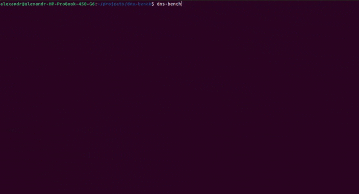

# dns-bench

[![Crates.io][crates-badge]][crates-url]
![Rust version][rust-version]
![License][license-badge]
[![Workflow Status][workflow-badge]][actions-url]

[crates-badge]: https://img.shields.io/crates/v/dns-bench.svg
[crates-url]: https://crates.io/crates/dns-bench
[license-badge]: https://img.shields.io/crates/l/dns-bench.svg
[workflow-badge]: https://github.com/qwerty541/dns-bench/workflows/check/badge.svg
[actions-url]: https://github.com/qwerty541/dns-bench/actions
[rust-version]: https://img.shields.io/badge/rust-1.74.1%2B-lightgrey.svg?logo=rust

## Description

This repository provides DNS benchmarking command line tool written in Rust. It iterates through built-in list of public DNS servers, measures their response time and print table with sorted results in console. It can be used to find the fastest DNS in your location for better internet browsing experience. An example of console output, list of features and list of built-in DNS servers can be found below.

### Example



### Features

- Built-in list of public DNS servers.
- Requests count configuration. By default, 10 requests are made to each DNS server.
- Threads count configuration. By default, 8 threads are used.
- Timeout configuration. By default, 3 seconds timeout is used.
- Domain configuration. By default, google.com domain is used.
- Protocol configuration, either TCP or UDP. By default, UDP is used.
- Lookup IP version configuration, either IPv4 or IPv6. By default, IPv4 is used.
- Configuration of IP version used to establish connection, either IPv4 or IPv6. By default, IPv4 is used.
- Table style configuration. By default, rounded style is used.
- Ability to save favorite configurations in a file inside user's home directory (`/home/user/.dns-bench/config.toml`) to avoid typing them every time.
- Ability to provide custom servers list instead of built-in list.

### List of built-in DNS servers

- Google Public DNS
- Cloudflare
- Quad9
- ControlD
- OpenDNS
- CleanBrowsing
- AdGuard DNS
- Comodo Secure DNS
- Level3
- Verisign

## Installation

### From crates.io (Recommended)

Run the following command and wait until the crate is compiled:

```sh
$ cargo install dns-bench
```

Now you can run compiled binary:

```sh
$ dns-bench [OPTIONS]
```

### From git repository

Run the following command and wait until the crate is compiled:

```sh
$ cargo install --git https://github.com/qwerty541/dns-bench.git --tag v0.5.1 dns-bench
```

Also you can remove tag option to install the latest development version.

Now you can run compiled binary:

```sh
$ dns-bench [OPTIONS]
```

## Options

Below is a list of currently supported options.

<table>
    <thead>
        <th>Option</th>
        <th>Description</th>
        <th>Default value</th>
        <th>Possible values</th>
    </thead>
    <tbody>
        <tr>
            <td><code>--domain</code></td>
            <td>Domain to resolve.</td>
            <td>google.com</td>
            <td>Any domain</td>
        </tr>
         <tr>
            <td><code>--threads</code></td>
            <td>Number of threads to use.</td>
            <td>8</td>
            <td>Any positive integer</td>
        </tr>
        <tr>
            <td><code>--requests</code></td>
            <td>Number of requests to each DNS server.</td>
            <td>10</td>
            <td>Any positive integer</td>
        </tr>
        <tr>
            <td><code>--timeout</code></td>
            <td>Timeout in seconds.</td>
            <td>3</td>
            <td>Any positive integer</td>
        </tr>
        <tr>
            <td><code>--protocol</code></td>
            <td>Protocol to use.</td>
            <td>udp</td>
            <td>tcp, udp</td>
        </tr>
        <tr>
            <td><code>--name-servers-ip</code></td>
            <td>IP version to use for establishing connection.</td>
            <td>v4</td>
            <td>v4, v6</td>
        </tr>
        <tr>
            <td><code>--lookup-ip</code></td>
            <td>IP version to use for lookup.</td>
            <td>v4</td>
            <td>v4, v6</td>
        </tr>
        <tr>
            <td><code>--style</code></td>
            <td>Table style to use.</td>
            <td>rounded</td>
            <td>empty, blank, ascii, psql, markdown, modern, sharp, rounded, modern-rounded, extended, dots, re-structured-text, ascii-rounded</td>
        </tr>
        <tr>
            <td><code>--save-config</code></td>
            <td>Save the configurations to a file in users home directory.</td>
            <td></td>
            <td></td>
        </tr>
        <tr>
            <td><code>--custom-servers-file</code></td>
            <td>Provide a path to a file with custom servers list to use instead of built-in list. An example of file format can be found <a href="./ipv4-custom-servers-example.txt">here for IPv4</a> and <a href="./ipv6-custom-servers-example.txt">here for IPv6</a>.</td>
            <td></td>
            <td></td>
        </tr>
    </tbody>
</table>

## License

Licensed under either of

-   Apache License, Version 2.0, ([LICENSE-APACHE](LICENSE-APACHE) or https://www.apache.org/licenses/LICENSE-2.0)
-   MIT license ([LICENSE-MIT](LICENSE-MIT) or https://opensource.org/licenses/MIT)

at your option.

## Contribution

Unless you explicitly state otherwise, any contribution intentionally
submitted for inclusion in the work by you, as defined in the Apache-2.0
license, shall be dual licensed as above, without any additional terms or
conditions.
