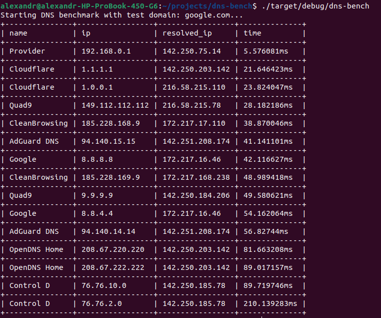

# dns-bench

[![Crates.io][crates-badge]][crates-url]
![Rust version][rust-version]
![License][license-badge]
[![Workflow Status][workflow-badge]][actions-url]

[crates-badge]: https://img.shields.io/crates/v/dns-bench.svg
[crates-url]: https://crates.io/crates/dns-bench
[license-badge]: https://img.shields.io/crates/l/dns-bench.svg
[workflow-badge]: https://github.com/qwerty541/dns-bench/workflows/check/badge.svg
[actions-url]: https://github.com/qwerty541/dns-bench/actions
[rust-version]: https://img.shields.io/badge/rust-1.70.0%2B-lightgrey.svg?logo=rust

## Description

This repository provides DNS benchmarking command line tool written on Rust. It iterates through prepared list of public DNS servers, measures their response time and print table with sorted results in console. It can be used to determine the fastest DNS for yourself. An example of output is shown below.

### Example



### Supported DNS servers list

- Google Public DNS
- Cloudflare
- Quad9
- ControlD
- OpenDNS
- CleanBrowsing
- AdGuard DNS
- Comodo Secure DNS
- Level3
- Verisign

## Installation

### From crates.io (Recommended)

Run the following command and wait until the crate is compiled:

```sh
$ cargo install dns-bench
```

Now you can run compiled binary:

```sh
$ dns-bench
```

### From git repository

At first clone project using the following command:

```sh
$ git clone git@github.com:qwerty541/dns-bench.git
```

Than you need to compile crate by running the following command in project directory:

```sh
$ cargo build
```

Now you can run compiled binary:

```sh
$ ./target/debug/dns-bench
```

## Options

Below is a list of currently supported options.

```
$ dns-bench --help
Determine the fastest DNS for yourself using simple command line tool.

Usage: dns-bench [OPTIONS]

Options:
      --domain <DOMAIN>
          The domain to resolve [default: google.com]
      --threads <THREADS>
          The number of threads to use [default: 8]
      --requests <REQUESTS>
          The number of requests to make [default: 3]
  -h, --help
          Print help
  -V, --version
          Print version
```

## License

Licensed under either of

-   Apache License, Version 2.0, ([LICENSE-APACHE](LICENSE-APACHE) or https://www.apache.org/licenses/LICENSE-2.0)
-   MIT license ([LICENSE-MIT](LICENSE-MIT) or https://opensource.org/licenses/MIT)

at your option.

## Contribution

Unless you explicitly state otherwise, any contribution intentionally
submitted for inclusion in the work by you, as defined in the Apache-2.0
license, shall be dual licensed as above, without any additional terms or
conditions.
