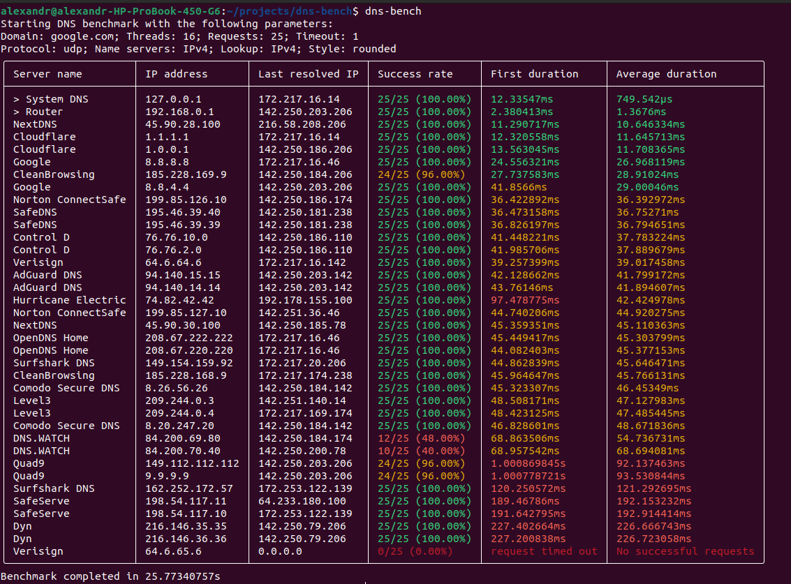
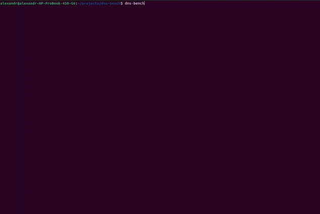

# dns-bench <!-- omit in toc -->

[![Crates.io version][crates-version-badge]][crates-url]
[![Crates.io downloads][crates-downloads-badge]][crates-url]
![Rust version][rust-version]
![License][license-badge]
[![Workflow Status][workflow-badge]][actions-url]

[crates-version-badge]: https://img.shields.io/crates/v/dns-bench.svg
[crates-downloads-badge]: https://img.shields.io/crates/d/dns-bench.svg
[crates-url]: https://crates.io/crates/dns-bench
[license-badge]: https://img.shields.io/crates/l/dns-bench.svg
[workflow-badge]: https://github.com/qwerty541/dns-bench/workflows/check/badge.svg
[actions-url]: https://github.com/qwerty541/dns-bench/actions
[rust-version]: https://img.shields.io/badge/rust-1.82.0%2B-lightgrey.svg?logo=rust

<details>
<summary>Table of contents</summary>

- [Description](#description)
  - [Preview](#preview)
    - [Image](#image)
    - [Animation](#animation)
  - [Features](#features)
    - [🚀 Core Features](#-core-features)
    - [⚙️ Configuration \& Flexibility](#️-configuration--flexibility)
    - [📊 Output \& Usability](#-output--usability)
    - [🐳 Platform \& Integration](#-platform--integration)
  - [List of built-in DNS servers](#list-of-built-in-dns-servers)
- [Installation](#installation)
  - [Which method to choose?](#which-method-to-choose)
  - [From crates.io](#from-cratesio)
  - [From git repository](#from-git-repository)
  - [From Docker Hub](#from-docker-hub)
- [Options](#options)
- [License](#license)
- [Contribution](#contribution)
</details>

## Description

This repository provides a DNS benchmarking command-line tool written in Rust. It iterates through a built-in list of public DNS servers as well as automatically detected system DNS servers, measures their response times, and prints a table of sorted results in the console. You can use it to find the fastest DNS server for your location, improving your internet browsing experience. A preview, list of features, and the list of built-in DNS servers are provided below.

### Preview

#### Image



#### Animation



### Features

#### 🚀 Core Features

- **Built-in list of public DNS servers**  
  Includes popular providers like Google, Cloudflare, Quad9, and more.
- **Automatic detection of system DNS servers**  
  Detects and highlights your system's configured DNS servers (Linux, Windows, macOS).
- **Multi-threaded benchmarking**  
  Runs benchmarks in parallel for faster results.

#### ⚙️ Configuration & Flexibility

- **Customizable request count, thread count, timeout, and domain**  
  Fine-tune how many requests, threads, and which domain to test.
- **Protocol and IP version selection**  
  Choose between UDP/TCP and IPv4/IPv6 for both lookup and connection.
- **Custom DNS server lists**  
  Use your own list of DNS servers instead of the built-in set.

#### 📊 Output & Usability

- **Multiple output formats**  
  Human-readable table, JSON, XML, or CSV for easy integration and analysis.
- **Configurable table styles**  
  Choose from various table styles for better readability.
- **Save favorite configurations**  
  Store your preferred settings in a config file for quick reuse.

#### 🐳 Platform & Integration

- **Docker support**  
  Run easily in a containerized environment (system DNS detection is skipped in Docker).
- **Cross-platform**  
  Works on Linux, Windows, and macOS.

### List of built-in DNS servers

<table>
<tr><td>

- Google Public DNS
- Cloudflare
- Quad9
- ControlD
- OpenDNS
- CleanBrowsing

</td><td>

- AdGuard DNS
- Comodo Secure DNS
- Level3
- Verisign
- DNS.WATCH
- Norton ConnectSafe

</td><td>

- SafeDNS
- NextDNS
- Dyn
- Hurricane Electric
- Surfshark DNS
- SafeServe

</td></tr>
</table>

## Installation

### Which method to choose?

- If you don't have Rust programming language environment installed on your machine, then [installation from Docker Hub](#from-docker-hub) will be the best option for you.
- If you have Rust programming language environment installed on your machine, then you can choose between [installation from crates.io](#from-cratesio) or [installation from git repository](#from-git-repository).
- Installation from git repository is suitable only when you want to use the development version instead of the stable one or the crates.io service is unavailable.

### From crates.io

Run the following command and wait until the crate is compiled:

```sh
$ cargo install dns-bench
```

Now you can run compiled binary:

```sh
$ dns-bench [OPTIONS]
```

### From git repository

Run the following command and wait until the crate is compiled:

```sh
$ cargo install --git https://github.com/qwerty541/dns-bench.git --tag v0.9.1 dns-bench
```

Also you can remove tag option to install the latest development version.

Now you can run compiled binary:

```sh
$ dns-bench [OPTIONS]
```

### From Docker Hub

Run the following command to pull the image:

```sh
$ docker pull qwerty541/dns-bench:latest
```

Now you can run this tool inside the container:

```sh
$ docker run --rm -it --name dns-bench qwerty541/dns-bench:latest
```

If you want to pass some options, you can do it like this:

```sh
$ docker run --rm -it --name dns-bench qwerty541/dns-bench:latest /bin/bash -c "dns-bench --requests 20 --domain microsoft.com --style re-structured-text"
```

In case you want to use custom servers list, you have to mount the file with custom servers list to the container and pass the path to the file as an argument:

```sh
$ docker run --rm -it --name dns-bench --volume /home/alexandr/projects/dns-bench/examples/ipv4-custom-servers-example.txt:/ipv4-custom-servers-example.txt qwerty541/dns-bench:latest /bin/bash -c "dns-bench --custom-servers-file /ipv4-custom-servers-example.txt"
```

## Options

Below is a list of currently supported options.

<table>
    <thead>
        <th>Option</th>
        <th>Description</th>
        <th>Default value</th>
        <th>Possible values</th>
    </thead>
    <tbody>
        <tr>
            <td><code>--domain</code></td>
            <td>Domain to resolve.</td>
            <td>google.com</td>
            <td>Any domain</td>
        </tr>
         <tr>
            <td><code>--threads</code></td>
            <td>Number of threads to use.</td>
            <td>8</td>
            <td>1..256</td>
        </tr>
        <tr>
            <td><code>--requests</code></td>
            <td>Number of requests to each DNS server.</td>
            <td>25</td>
            <td>1..1000</td>
        </tr>
        <tr>
            <td><code>--timeout</code></td>
            <td>Timeout in seconds.</td>
            <td>3</td>
            <td>1..60</td>
        </tr>
        <tr>
            <td><code>--protocol</code></td>
            <td>Protocol to use.</td>
            <td>udp</td>
            <td>tcp, udp</td>
        </tr>
        <tr>
            <td><code>--name-servers-ip</code></td>
            <td>IP version to use for establishing connection.</td>
            <td>v4</td>
            <td>v4, v6</td>
        </tr>
        <tr>
            <td><code>--lookup-ip</code></td>
            <td>IP version to use for lookup.</td>
            <td>v4</td>
            <td>v4, v6</td>
        </tr>
        <tr>
            <td><code>--style</code></td>
            <td>Table style to use.</td>
            <td>rounded</td>
            <td>empty, blank, ascii, psql, markdown, modern, sharp, rounded, modern-rounded, extended, dots, re-structured-text, ascii-rounded</td>
        </tr>
        <tr>
            <td><code>--save-config</code></td>
            <td>Save the configurations to a file in users home directory.</td>
            <td></td>
            <td></td>
        </tr>
        <tr>
            <td><code>--custom-servers-file</code></td>
            <td>Provide a path to a file with custom servers list to use instead of built-in list. An example of file format can be found <a href="./examples/ipv4-custom-servers-example.txt">here for IPv4</a> and <a href="./examples/ipv6-custom-servers-example.txt">here for IPv6</a>.</td>
            <td></td>
            <td></td>
        </tr>
        <tr>
            <td><code>--format</code></td>
            <td>Format of the output.</td>
            <td>human-readable</td>
            <td>human-readable, json, xml, csv</td>
        </tr>
        <tr>
            <td><code>--skip-system-servers</code></td>
            <td>Skip auto detection of system DNS servers.</td>
            <td></td>
            <td></td>
        </tr>
    </tbody>
</table>

## License

Licensed under either of

-   Apache License, Version 2.0, ([LICENSE-APACHE](LICENSE-APACHE) or https://www.apache.org/licenses/LICENSE-2.0)
-   MIT license ([LICENSE-MIT](LICENSE-MIT) or https://opensource.org/licenses/MIT)

at your option.

## Contribution

Unless you explicitly state otherwise, any contribution intentionally
submitted for inclusion in the work by you, as defined in the Apache-2.0
license, shall be dual licensed as above, without any additional terms or
conditions.
